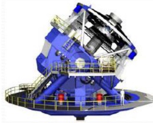
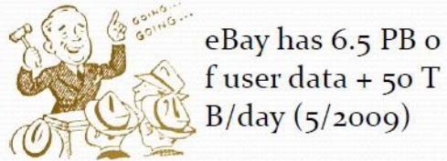
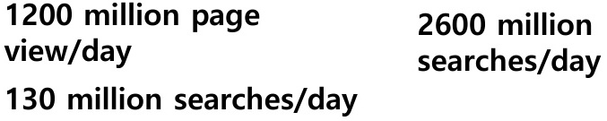
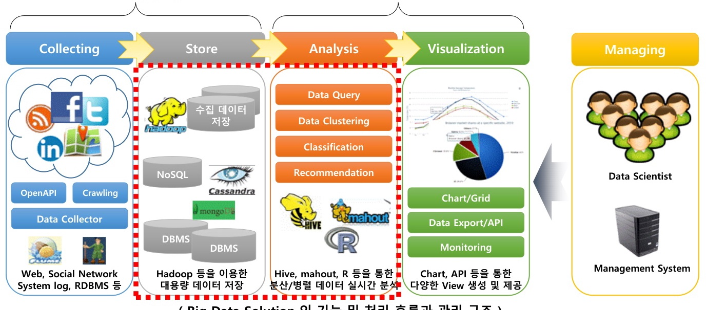
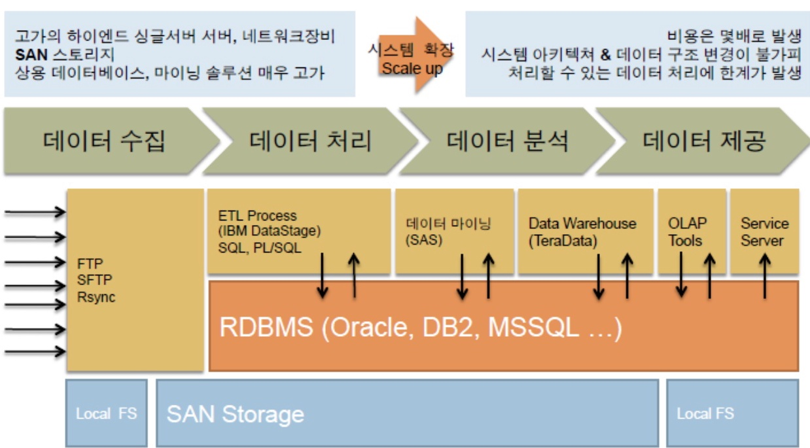
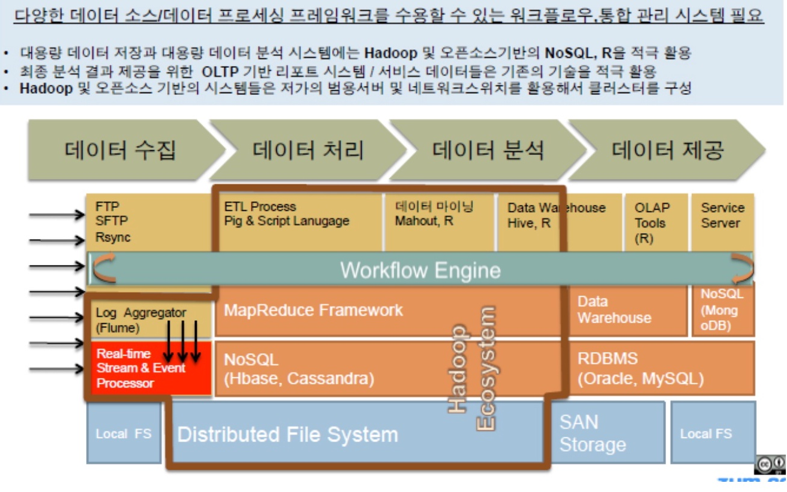
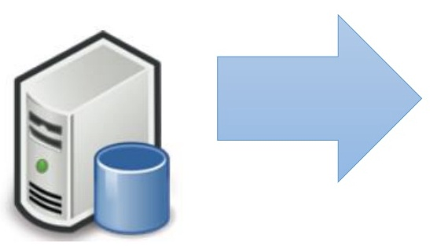
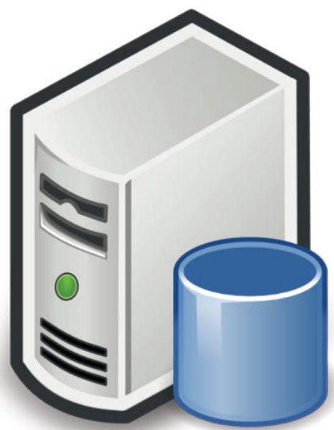

Hadoop
<빅데이터와 Hadoop>

# 전남대학교
김경백

# 학습목표

- •2-1주차 : 빅데이터의 개념과 이에 따른
- 변화 및 Hadoop의 개발 배경을 학습한
- 다.
- •빅데이터의 개념 : 빅데이터의 세가지요
- 소 (크기, 속도, 다양성)에 대해 학습한다.
- •빅데이터 처리 절차 : 빅데이터 처리절차
- 및 필요한 내용을 학습한다.
- •Hadoop의 개발 배경 : 빅데이터 분산처
- 리 시스템의 개발 배경을 이해한다.

# 빅데이터

# •현재의 관계형 데이터베이스 시스템
의 저장 역량을 넘어가는 크기의 대
용량 데이터

# 빅데이터는 어디서오는가?

- • 과학적실험
- • 모바일 기기
- • 위치 추적 시스템
- • 센서 기반 시스템
- • 소셜 네트워크
- • 인터넷 검색 시스템
- • 동영상 시스템
- • 온라인 쇼핑 시스템

# Google TM PB/day (2008)

# 20

# DNA Sequencing Throughput:
Increasing 5x per year

# Facebook: 36PB of user dat
90TB/day (2010)

LSST: 3TB/day of image data
6-10 PB of raw data /year (2020)

# Walmart, Amazon, NYSE...
Economist: mankind produced
1,200 Exabytes (billion GB) in 2010

# LHC: 10-15PB/year

# 11,574 messages/sec

| 1200 million page | 2600 million |
| --- | --- |
| view/day | searches/day |
| 130 million searches/day |  |

# Data from IoT

# • 자율주행차 예시

- • 백만대 자동차, 자동차에는 1개 센서
- • 매 10초마다 100Byte 센서데이터를 수집

100Byte * 6 (1min) * 60 (1hour) * 24 (1day) *
100 million
= 864,000 * 1,000,000
= 864 GB (per Day)

# Many a little makes a mickle

- • 작은 의미들을 여럿 모아서 큰 의미를 만든다.
- •  작은 데이터들을 모아 의미 있는 데이터를 발견한다.

# • 인터넷에서 구글이 시작한 기조

- • 질의 검색 및 광고 링크 클릭 정보 수집
- • 음식점 리뷰, 여행정보, 지도 정도 수집
- • 교통 정보 수집
- • 사용자 정보 및 안드로이드 기기 활용 정보 수집

# • Amazon CEO Says

- • We never trash out our data.
- • 우리는 우리의 데이터를 절대 버리지 않는다.

# 빅데이터의 특징

# •데이터의 “크기“ 때문에 다음의 작업들이
어려움

- • Collect data – 수집
- • Store data – 저장
- • Remove data – 삭제
- • Search data – 검색
- • Share data – 공유
- • Analyze data – 분석
- • Visualize data – 시각화

# 빅데이터의 세가지 요소

- 

- 

- 

# Volume (크기)

- •보다 고도화된 모델링을 위해서는 보다
- 많은 데이터 필요
- • 30개의 데이터 보다 300개의 데이터가 설명
- 이 명확한 통계 모델을 만들 수 있다.

- •큰 크기의 데이터를 다루기 위해 필요한
- 거?
- • 쉽게 확장 가능한 저장소
- • 분산된 질의 접근 가능성  HDFS
- • 분산 처리 플랫폼  Map/Reduce

# Velocity (속도)

# • 데이터 수집 속도

- • 데이터가 증가하는 속도
- • 의미론적으로 Volume과 비슷함

# • 데이터 분석 속도

- • 데이터 입력을 기준으로 의사결정을 내리는데 까지
- 걸리는 속도
- • 데이터 출력 속도와 관련됨

# • 속도를 지원하기 위해 필요한 것은?

# • 스트리밍(연속된) 데이터 처리

- • IBM : InfoSphere Streams, Twitter :Storm, Yahoo:S4
- • c.f.) Hadoop is a batch processing method

# Variety (다양성)

# • 데이터 소스가 다양함

# • 비정형 데이터 : Social network data, Sensor
Network Raw data, Web data

# • 관계형 데이터베이스는 적절하지 않을 수 있음

•

- • 정형 데이터 : 관계형 데이터베이스에 저장이 용이한
- 데이터
- 다양성을 다루기 위해 무엇이 필요한가?

# • 적절한 데이터 타입의 정의가 필요함

- • XML encoded documents : MarkLogic XML repository
- • Social Network Graph : Neo4J Graph Database

# • NoSQL : 반 정형 데이터베이스

# 왜 빅데이터가 조명되는가?

- •저장 비용의 극적인 하락
- •연결성의 기하급수적 증가
- •분산 처리 및 분석과 관련된 기술 개
- 선

# 빅데이터를 활용한 새로운 가치 창출

Big
Data

Big Data
Processing

# New
Value

# Key Point!!

# 빅데이터 처리 절차

# 데이터수집(Aggregation)

# 데이터활용(Utilization)

( Big Data Solution 의 기능 및 처리 흐름과 관리 구조 )
빅데이터 요소기술이 투입됨

# 기존 RDBMS기반 분석시스템

# DBMS 을 기반으로하는 데이터 플로우,Scale-up구조의 아키텍처

# 고가의 하이엔드 싱글서버 서버,네트워크장비
SAN 스토리지
상용 데이터베이스, 마이닝 솔루션 매우 고가

# 비용은 몇배로 발생

# 시스템 확장 시스템 아키텍쳐 & 데이터 구조 변경이 불가피

# Scale up 처리할 수 있는 데이터 처리에 한계가 발생

# 빅데이터 기술 기반 분석시스템

# 다양한 데이터 소스/데이터 프로세싱 프레임워크를 수용할수있는 워크플로우,통합 관리 시스템필요

- ·대용량 데이터 저장과 대용량 데이터 분석 시스템에는 Hadoop 및 오픈소스기반의 NoSQL, R을 적극 활용
- * 최종 분석 결과 제공을 위한 OLTP 기반리포트 시스템/서비스 데이터들은 기존의 기술을 적극 활용
- �Hadoop 및 오픈소스 기반의 시스템들은 저가의 범용서버 및 네트워크스위치를 활용해서 클러스터를구성

# Hadoop

- - 신뢰성, 확장성을 가지는 분산 컴퓨팅(처
- 리) 오픈소스 소프트웨어
- - Apache 에서 개발 지원 및 배포

# Hadoop이 개발되기까지

- • Feb 2003 First MapReduce Library by Google
- • Dec 2004 Google GFS file system paper
- • Feb 2006 Hadoop becomes Apache Lucene project
- • Apr 2007 Yahoo! Runs Hadoop on 1000-node cluster
- • Feb 2008 Yahoo! Generate production search index with Hadoop
- • July 2008 Hadoop Wins Terabyte Sort Benchmark

# • Sorted 1 terabytes of data in 209 seconds

# • July 2009 Hadoop is getting bigger

- • Hadoop Common, MapReduce, Hadoop Distributed File System
- (HDFS)
- • Dec 2011 Release 1.0.0
- • May 2012 Release 2.0.0 alpha
- • Dec 2017 Release 3.0.0
- • Mar 2024 Release 3.4.0

# Hadoop 접근 방식

- •Scale-out
- •Share nothing
- •Expect failure
- •Smart software, dumb hardware
- •Move processing, not data
- •Build applications, not infrastructure

# Scale Up

# Scale Out

# Example of hadoop project

# Hadoop은 언제 사용하는 것이 좋은가?

# 데이터가 크기 크지 않다
면 Hadoop을 사용하지 않
는 것이 좋다!!

- < 100 MB – Excel
- < 10 GB – Add memory and use Pandas
- < 1 TB – Buy big hard drive and use Postgres
- > 5TB – Consider Hadoop

# PANDAS

- • Panel Data System
- • 파이선 데이터 분석 라이브러리

# • R, MATLAB, SAS등과 유사

# • NumPy와 SciPy를 기반으로 구현

# • Matplotlib일부를 활용

- • 오픈소스, BSD 라이센스
- • 주요 요소

- • 시리즈 (Series)
- • 데이터프레임 (DataFrame)

# • 데이터 사이언티스트를 위한 이상적 도구

# • Munging data, Cleaning data, Analyzing data, Modeling data

# POSTGRES

- • PostgreSQL
- • 객체관계 데이터베이스 관리 시스템
- • Object-relational database management system
- (ORDBMS)

# 2-1 주차 정리

# • 빅데이터

- • 빅데이터 3요소 : Volume, Velocity, Variety
- • 빅데이터 처리 절차 : 수집-저장-분석-시각화

# • Hadoop

- • 신뢰성, 확장성을 가지는 분산 컴퓨팅(처리)
- 오픈소스 소프트웨어
- • Scale Out
- • 빅데이터 처리시에 필요
- • 데이터가 크기 크지 않다면 Hadoop을 사용하지
- 않는 것이 좋다!!

